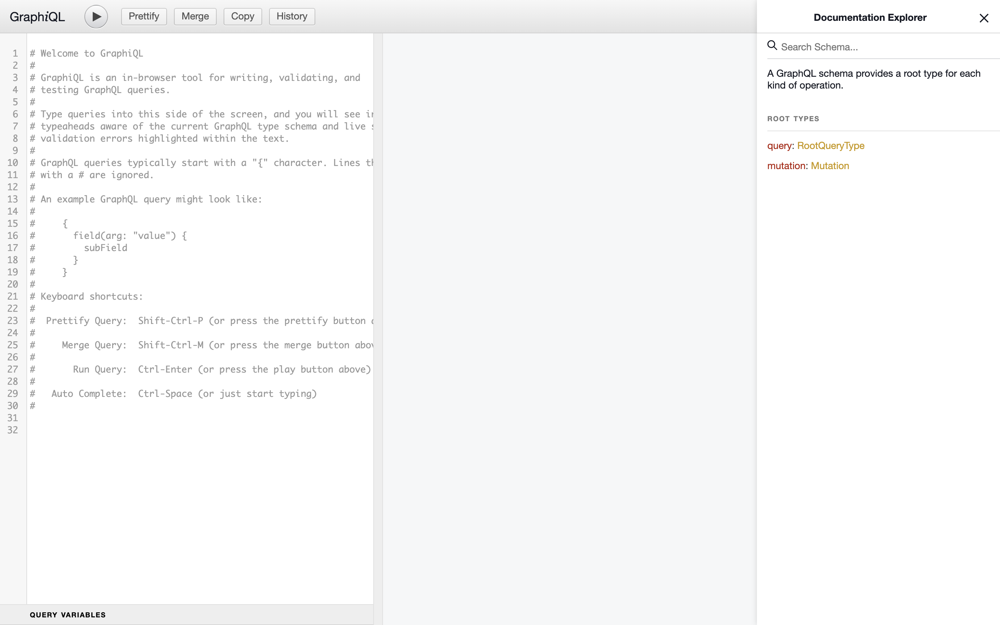
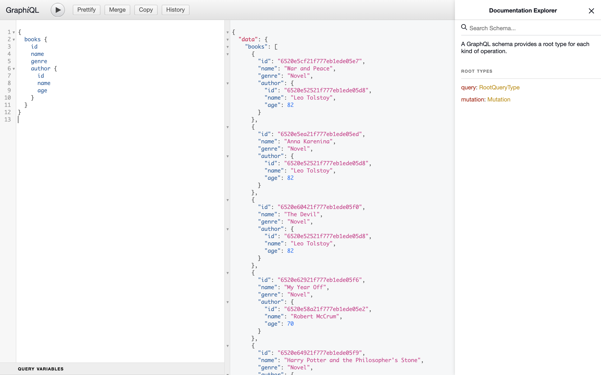
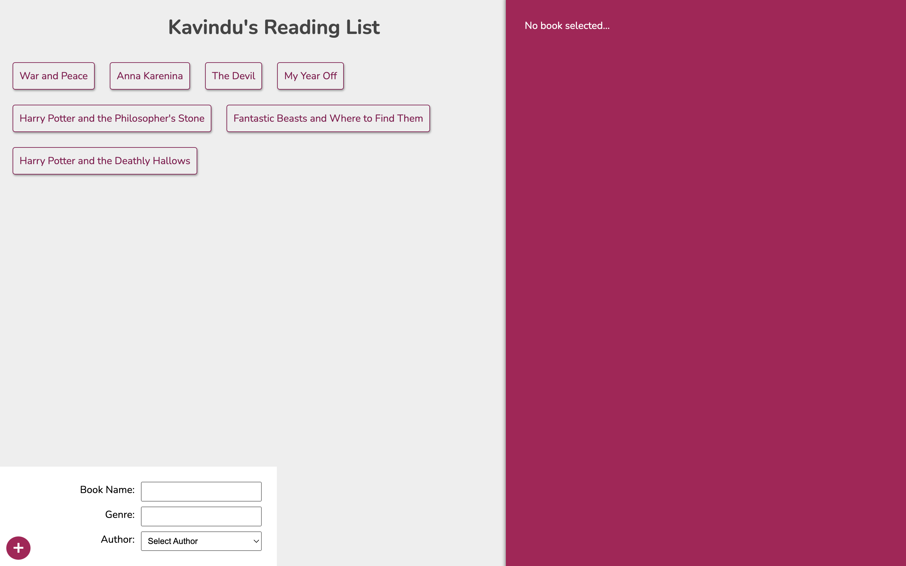
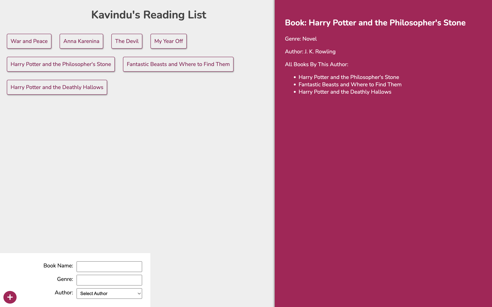

## Reading List App

#### This is a complete application with a `GraphQL` server on Node.js, a React front-end (using Apollo), and MongoDB for data storage.
<br>

### Getting Started With Backend

```bash
cd server
```
You should create a `.env` file including below variables.

- **`MONGODB_URL`**: This variable should contain your mongodb connection string for accessing database.

After that run below commands

```bash
npm install
node app
```
Server will be up and running on `http://localhost:4000`. Go to `http://localhost:4000/graphql`. You will see an interface like this.



You can interact with the database using this interface like this.



<br>

### Getting Started With Frontend

```bash
cd client
```
run below commands

```bash
npm install
npm start
```

React application will start and running on `http://localhost:3000`.





There you go! 🚀. Now you can easily add books to the list and explore the app. Thank You!🙌